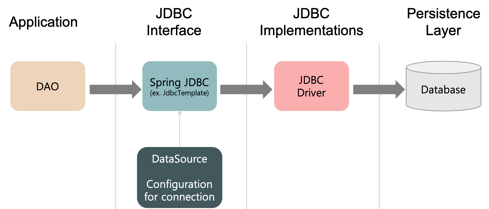
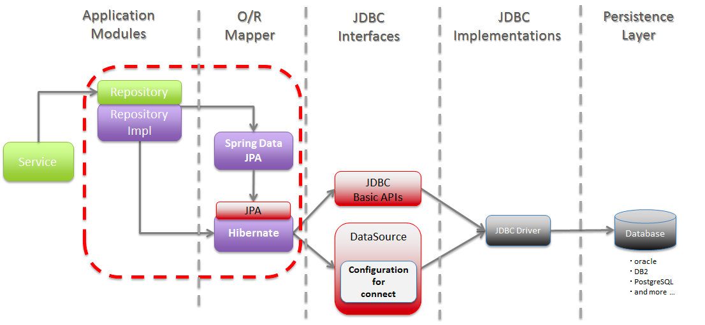

# 리액티브 프로그래밍에서의 DB 
* NoSQL 에서는 리액티브를 지원하는 DB 가 많다.
  * ex) Mongo, Redis, Cassandra, ES, Neo4j, Couchbase 등..
* 하지만 RDBMS 에서는 많이 없다. 
* JAVA 에서 DB 를 사용할 때 JDBC 나 JPQ 를  주로 사용한다

    
* JPA 와 JDBC 는 `블로킹 API` 다.
* 이는 리액티브 프로그래밍에 활용할 수 없다.
* JDBC 나 JPA 를 감싸서 리액티브 스트림 계층에서 사용할 수 있게 해주는 솔루션도 있기는 하지만, 이는 `내부 쓰레드 풀` 을 사용한다.
* 내부 쓰레드 풀은 왜 문제일까?

> 지난 20년간 소프트웨어 산업현장에서 배울 수 있었던 최고의 교훈은 장비의 코어 수 보다 많은 쓰레드를 사용하는 것은 장점이 거의 없다는 점이다.   
> 4코어 장비면 4개의 스레드로 구성된 쓰레드 풀을 사용하는 것이 좋다.   
> 4코어 장비에 100개의 스레드를 만들어 사용하면 CPU 컨텍스트 스위칭 오버헤드가 증가하고, 효율이 굉장히 많이 떨어진다.     
> by 스프링 부트 실전 활용 마스터 책

* 논블러킹 싱글 스레드 앱이 100 스레드 블로킹 앱 보다 처리량이 더 많을 수 있다. 
  * ex) redis, node.js
* 리액티브 프로그래밍에서 일부라도 리액티브하지 않고 블로킹된다면 앱이 제대로 동작하지 않는다.
* 100% 리액티브 앱을 만드려면 DB와 물리적 연결과 상호작용 과정에 비동기, 논블로킹 개념을 적용할 수 있는 데이터베이스 드라이버가 필요하다.
* 아직 1.0 버전이 릴리즈 되지 않았지만.. [r2dbc](https://r2dbc.io/) 라는것이 가장 많이 각광받고 있고 빠르게 진행되고있다.
* Spring Boot 에서도 [spring-data-r2dbc](https://spring.io/projects/spring-data-r2dbc) 로 지원한다.

